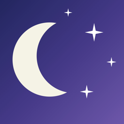
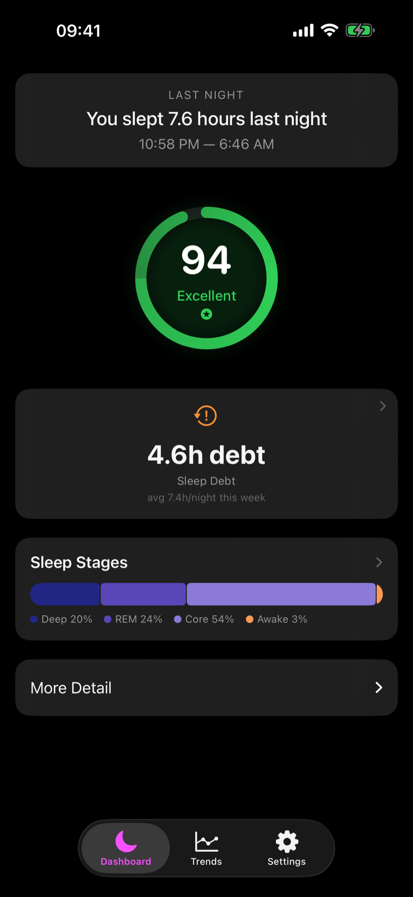
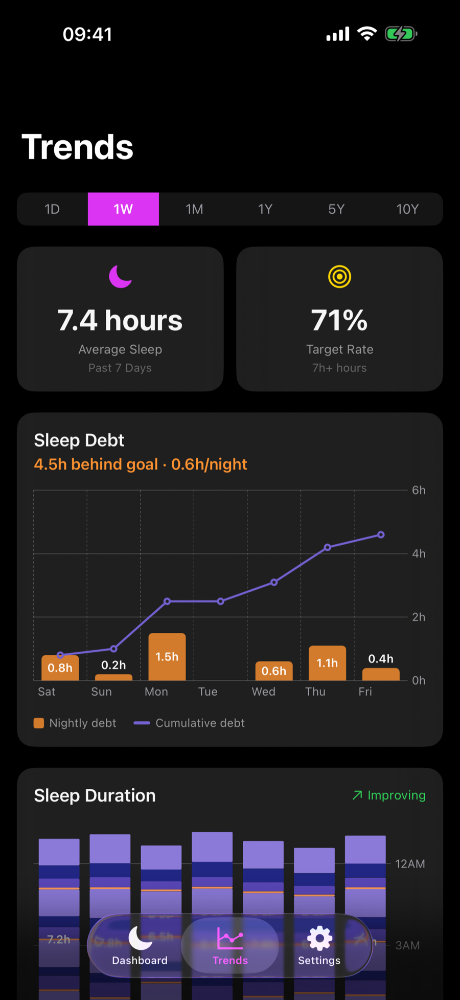
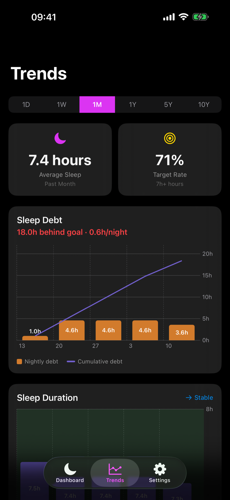

<div align="center">



# Somnus

**Sleep debt, made visible.**

A native iOS app that reads Apple Watch sleep data and turns it into a running view of your **sleep debt** — how far behind your target you have fallen, how that gap is changing, and whether your habits are helping you recover.

[](https://www.apple.com/ios/)
[](https://swift.org)
[](https://developer.apple.com/xcode/)
[](https://developer.apple.com/xcode/swiftui/)
[](https://developer.apple.com/documentation/healthkit)
[](https://developer.apple.com/documentation/charts)

[](https://emrahman.github.io/Somnus/)
[](LICENSE)
[](https://emrahman.github.io/Somnus/)
[](https://github.com/EMRahman/Somnus)
[](docs/privacy-policy.md)

[**Website**](https://emrahman.github.io/Somnus/) · [Support](https://emrahman.github.io/Somnus/support.html) · [Privacy Policy](https://emrahman.github.io/Somnus/privacy.html)

</div>

---

## Screenshots

<div align="center">

| Dashboard | Weekly debt | Monthly debt |
|:---:|:---:|:---:|
|  |  |  |
| A strong night and a growing deficit, side by side | Each night's shortfall, plus the running total | The same view, scaled out to a month |

<sub>Screenshots use deterministic sample data.</sub>

</div>

---

## Why Somnus?

Most people who routinely miss sleep do not experience the cost as one dramatic bad night. The shortfall accumulates gradually, making it easy to adapt to feeling "fine" without seeing how serious the deficit has become. Daily, weekly, and yearly sleep summaries can describe individual periods while still hiding that compounding trend.

Somnus is built around sleep debt: the gap between the sleep you need and the sleep you actually get. It turns Apple Watch data into a running view of that debt, showing when it is growing, when you are recovering, and how your current balance compares with your personal target. Sleep scores, stages, and duration remain useful context, but the central question is broader: **how much sleep do you owe yourself, and where is that trajectory heading?**

---

## Features

### Debt-First Dashboard

- **Sleep Debt at a Glance** — The headline card shows accumulated debt against your configured target, pairs it with your nightly average for the week, and uses severity styling to make the size of the problem difficult to overlook. Tap it to open the full weekly debt breakdown.
- **Sleep Score** — A 0–100 nightly composite of duration (35%), efficiency (25%), consistency (20%), and sleep stage quality (20%). It provides context for the latest night without replacing the longer-term debt picture.
- **Last Night Summary** — Duration, bedtime/wake time, and a horizontal stage breakdown bar showing Deep, REM, Core, and Awake proportions.
- **Weekly Quick Stats** — Average hours, target compliance (nights meeting your configured minimum), and efficiency percentage alongside the headline debt view.

### Sleep Debt Trends

The primary Trends chart pairs each period's shortfall with a running cumulative-debt line. It also shows your net balance—whether you are behind or ahead of your goal—and your average nightly shortfall, making both the current debt and its direction visible.

Switch between six time horizons—Daily, Weekly, Monthly, Yearly, 5 Years, and 10 Years—to see whether debt is an isolated dip, a recurring pattern, or a deficit that has compounded over months or years. The same debt calculation is reused throughout the app, deduplicating fragmented sleep sessions and excluding nights with no recorded sleep so missing data does not become phantom debt.

### Supporting Sleep Charts

Built with Apple's Swift Charts framework, duration charts provide the nightly and historical detail behind the debt trend:

| Period | Chart Type | Detail |
|--------|-----------|--------|
| **Daily / Weekly** | Per-night timeline | Clock-time bedtime→wake bars, coloured by sleep stage |
| **Monthly** | Weekly averages | 4-week rolling view |
| **Yearly** | Monthly averages | 12-month bird's-eye view |
| **5 / 10 Years** | Yearly averages | Multi-year bird's-eye view |

Every duration chart renders a green target zone spanning your configured goal band (Minimum Acceptable → Target Sleep, 7–8 hours by default) so you can see which nights and periods are driving the debt trend. Bars below your minimum turn orange.

**Patterns** — A compact list of the handful of findings that aren't already visible as a chart or score: a weekend/weekday gap over 1.5h ("social jet lag"), bedtimes past midnight on more than a third of nights, and whichever sleep stage (deep or REM) is running below its ideal range. Only shown when triggered.

### Settings

- Configurable sleep target ("Target Sleep", used for debt calculations) and minimum acceptable hours ("Minimum Acceptable", used for target-compliance stats and chart thresholds)
- HealthKit setup status and re-authorization
- Dark theme toggle

---

## Architecture

```
Somnus/
├── App/
│   ├── SomnusApp.swift              # Entry point, onboarding gate
│   └── ContentView.swift            # Tab bar (Dashboard, Trends, Settings)
├── Models/
│   ├── SleepRecord.swift            # Night session, stages, computed metrics
│   ├── SleepMetrics.swift           # Aggregated stats, scores, chart data points
│   └── SleepPatternFlag.swift       # Compact non-redundant pattern findings
├── Services/
│   ├── HealthKitManager.swift       # HealthKit queries, sample grouping, observation
│   └── SleepAnalysisEngine.swift    # Scoring, debt, trend/pattern detection, chart data
├── ViewModels/
│   ├── DashboardViewModel.swift     # Dashboard state and data loading
│   └── TrendsViewModel.swift        # Chart data and period switching
├── Views/
│   ├── Dashboard/                   # Score ring, stage bar, quick stats
│   ├── Trends/                      # Charts, sleep debt, patterns, period selector
│   ├── Settings/                    # Preferences, HealthKit info sheet
│   └── Components/                  # MetricCard, SleepStageBar
├── Extensions/
│   ├── Color+Theme.swift            # Full color palette (stages, scores, trends)
│   └── Date+Extensions.swift        # Formatting helpers
└── Resources/
    ├── Info.plist                    # Permissions (NSHealthShareUsageDescription)
    ├── Assets.xcassets/              # App icon, accent color
    └── Somnus.entitlements           # HealthKit + background delivery
```

**Pattern**: MVVM with `@MainActor` ViewModels, `@Published` state, and Swift concurrency (`async/await`).

**Frameworks**: SwiftUI · HealthKit · Swift Charts · Combine

---

## Scoring Model

The sleep score (0–100) is built from four components:

| Component | Weight | How It's Scored |
|-----------|--------|-----------------|
| **Duration** | 35% | 100 at 7–8h, linear penalty for under 7h or over 9h |
| **Efficiency** | 25% | 100 at ≥ 85% (time asleep ÷ time in bed), scales linearly |
| **Consistency** | 20% | 100 at ≤ 15 min bedtime σ, drops toward 0 at 120+ min |
| **Sleep Stages** | 20% | Compares deep (target 20%) and REM (target 25%) to ideals |

Scores map to grades:

| Grade | Range |
|-------|-------|
| Excellent | 90–100 |
| Good | 75–89 |
| Fair | 60–74 |
| Poor | 40–59 |
| Very Poor | 0–39 |

---

## HealthKit Integration

Somnus requests **read-only** access to `HKCategoryTypeIdentifier.sleepAnalysis`. It reads:

- Sleep stage samples (Awake, REM, Core, Deep) from Apple Watch
- In-bed time from manual or automatic detection
- Start and end timestamps per sample

Raw HealthKit samples are grouped into nightly `SleepRecord` objects using a 2-hour gap threshold. Background delivery is enabled so data updates automatically after the watch syncs.

**No health data is written, transmitted, or stored outside the device.**

---

## Requirements

| Requirement | Version |
|-------------|---------|
| iOS | 17.0+ |
| Swift | 5.9 |
| Xcode | 15.0+ |
| Device | iPhone (iPad supported) |
| Data source | Apple Watch with sleep tracking enabled |

---

## Setup

The project uses [XcodeGen](https://github.com/yonaskolb/XcodeGen) to generate the Xcode project from `project.yml`.

```bash
# Install XcodeGen (one-time)
brew install xcodegen

# Generate and open the project
cd Somnus
xcodegen generate
open Somnus.xcodeproj
```

Then in Xcode:
1. Set your **Development Team** under Signing & Capabilities.
2. Build and run on a physical device (HealthKit requires a real device for live data; the simulator works with preview mock data).

---

## Tests

`SomnusTests` covers the analysis engine: nightly dedupe of fragmented sessions, sleep-debt bucketing, score edge cases (phantom "in bed only" records, fragmented nights), the daily fetch window, and grade boundaries. The Somnus scheme includes the test target — run with **⌘U** in Xcode.

---

## Preview Data

All ViewModels include `#if DEBUG` static preview properties with a realistic 7-day mock dataset. Sleep stages are generated with proper 90-minute cycle modeling — more deep sleep early in the night, more REM later — so previews accurately represent real-world data shapes.

```swift
// Example: preview the dashboard in Xcode Canvas
#Preview {
    DashboardView()
        .environmentObject(DashboardViewModel.preview)
}
```

---

## Privacy

- Somnus reads sleep data from Apple HealthKit with explicit user permission.
- All data stays on-device. There are no network calls, analytics, or telemetry.
- All scoring, debt, and trend calculations run entirely locally — no data is sent to any server.
- HealthKit access can be revoked at any time through iOS Settings → Privacy → Health.

Full policy: [docs/privacy-policy.md](docs/privacy-policy.md) · [emrahman.github.io/Somnus/privacy.html](https://emrahman.github.io/Somnus/privacy.html)

---

## License

Released under the [MIT License](LICENSE). © 2026 Ehsan Rahman.

<sub>Somnus provides educational wellness insights, not medical advice. Apple, Apple Health, Apple Watch, and iPhone are trademarks of Apple Inc. Somnus is an independent project and is not affiliated with Apple.</sub>
